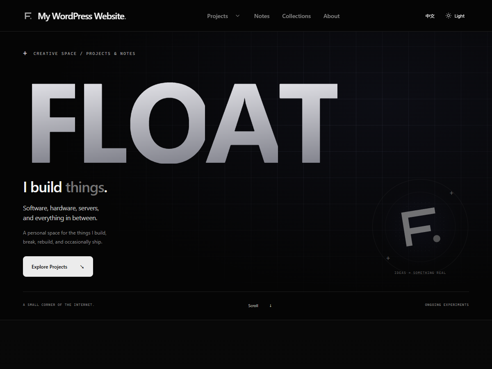

# FLOAT Space

一个轻量的 WordPress 作品集主题：大字排版、克制的鼠标动效、中英文切换，以及深浅主题。前台使用原生 HTML、CSS 和 JavaScript，无需构建框架。

公开版使用通用文案和原创 SVG。主题与配套插件分开安装；没有个人站点配置、联系方式、备案号码、账号、数据库、部署脚本或第三方游戏图片。

[English documentation](README.en.md)



## 安装

要求 WordPress 6.5+、PHP 8.1+。从本仓库的 **v1.1.0 Release** 下载安装包；本次主题版本为 1.1.0，配套插件保持 1.0.0。GitHub 的“Download ZIP”是源码仓库，不能直接作为主题安装。

1. 后台 → 外观 → 主题 → 安装主题 → 上传 `float-space-1.1.0.zip`，安装并启用。
2. 如需管理项目、双语内容或配置收藏，后台 → 插件 → 安装插件 → 上传 `float-content-1.0.0.zip`，启用 FLOAT Content。
3. 按配套插件的设置页完成首页、笔记页和可选配置收藏页设置；也可以手动创建页面，在“设置 → 阅读”指定静态首页和文章页。
4. 在“设置 → FLOAT 网站文字”填写自己的中英文文案、GitHub 地址、联系邮箱和可选备案信息。在“外观 → 自定义”设置站点标志，在“外观 → 菜单”设置导航。

插件启用后不会导入项目、创建用户、迁移账号或覆盖已有站点名称。可选的演示内容只用于了解布局，请根据自己的需求设置后再发布。

## 功能

- 原生文章与独立项目类型；双语标题、摘要和正文，英文留空时回退到中文。
- 可编辑首页文案、自定义标志及导航；GitHub、邮箱、备案信息默认不显示。
- 分层导航、项目简介和当前栏目提示；桌面空间不足时自动改用展开面板，手机面板包含语言与主题设置。
- 深浅主题、中英文偏好存储在当前浏览器；支持键盘导航与减少动态效果设置。
- 可选配置收藏模板，包含原创虚构示例目录、本机草稿、导入导出、撤销和复制。示例不对应任何真实游戏或有效兑换代码。
- 配套插件使用权限、nonce、字段验证与发布检查；只有有效的公开配置进入只读公开接口。

主题单独启用时可显示首页与原生文章；项目管理和配置收藏需要配套插件。停用插件不会删除已保存的内容。

## 配置导航

在“外观 → 菜单”创建菜单，并指定到主导航位置。拖动菜单项可以调整顺序和父子关系；主题保留嵌套层级，建议常用导航以两层为主。页脚菜单只显示第一层。

展开一个菜单项后，可填写“英文名称 / English label”、“中文简介 / Chinese description”和“英文简介 / English description”。英文名称留空时使用原名称，常见默认栏目使用内置翻译；子菜单可显示双语简介。菜单项原生“描述”字段也可以作为中文简介的后备值。保存菜单即可生效，无需配套插件。

未指定主导航时，主题根据站点内容生成默认导航：项目菜单最多显示五个已公开且无密码保护的项目，以及“查看全部项目”入口；笔记和可选收藏入口按站点设置显示。

父级文字链接直接打开页面，相邻箭头按钮负责展开子菜单。Tab 按页面顺序移动，方向键可进入子菜单，Esc 逐层收起并返回相应按钮。手机展开面板独立滚动，通过 Esc 或背景关闭按钮收起后会恢复菜单按钮焦点；关闭 JavaScript 时，导航链接仍可访问。页面滚动后桌面栏会变紧凑，系统“减少动态效果”设置会关闭导航过渡。搜索功能留待后续版本。

## 隐私与素材

本仓库及安装包只包含可复用应用源码和通用示例。没有分析统计、追踪脚本、远程监控连接或自动上传本机草稿的行为。自行填写的联系邮箱、备案信息以及发布内容会显示给访客；不要在公开字段中填写密码或其他秘密。

全部随附图形为原创 SVG，代码与图形采用 GPL-2.0-or-later。未包含第三方游戏素材、硬件照片或字体。详见 [素材说明](docs/ASSETS.md) 和 [隐私说明](docs/PRIVACY.md)。

## 从源码打包

需要 Python 3.10+；不需要 Node.js 或前端构建工具。

```sh
python tools/privacy-check.py
python tools/build-release.py
```

输出位于 `dist/`，包括两个可直接安装的 ZIP 和 `SHA256SUMS.txt`。脚本只打包 `theme/float-space/` 与 `plugin/float-content/`，不会打包工作区、Git 历史或测试文件。发布前应人工审阅源码和截图；自动扫描不能代替人工审查。

## 开发与验证

```sh
python -m unittest discover -s tests -p "test_*.py"
```

CI 执行隐私扫描、PHP 语法检查、JavaScript 语法检查及隔离的 WordPress 集成测试。开发预览使用官方 [WordPress Playground CLI](https://wordpress.github.io/wordpress-playground/developers/local-development/wp-playground-cli/)，见 [开发说明](docs/DEVELOPMENT.md)。

这是 GitHub 发布的经典主题，不代表已获 WordPress.org 主题目录审核。欢迎通过 issue 或 pull request 提交改进；报告问题时请清理截图、日志和配置中的个人信息。

## 许可

GPL-2.0-or-later。完整条款见 [LICENSE](LICENSE)。
